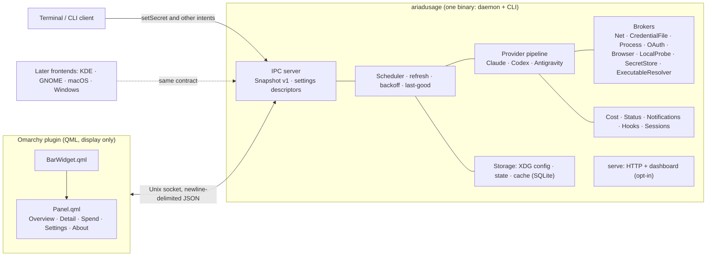

# AriadUsage — System Architecture

> **Status:** design authority for v1. Nothing described here is implemented
> unless the [Roadmap](#13-roadmap) marks its milestone done. Lockfiles and
> manifests own exact versions once they exist.

AriadUsage tracks the usage, quotas and cost of AI coding assistants. It is an
independent Rust reimplementation of [CodexBar](https://github.com/steipete/CodexBar):
the same ideas and behavior, a different language, and no runtime bridge to the
`codexbar` binary.

**v1** is an Omarchy bar-widget plugin backed by a Rust engine. It reaches full
CodexBar parity for exactly three providers, **Claude**, **Codex** and
**Antigravity**: every source of data and every feature CodexBar has for them.
CodexBar's other 88 providers arrive in waves after v1. The engine is built so
that those providers, other Linux desktops, macOS and Windows can be added
without rewriting it.

The name follows the Ariad family: Ariadne's thread is the line you follow to
see how far you have gone and how much is left.

---

## 1. Architectural Principles

| # | Principle | Concrete implications |
|---|---|---|
| 1 | One engine, many frontends | The engine owns all data, refresh, credentials and policy. Frontends (the Omarchy plugin now; KDE, GNOME, macOS and Windows later) only render and send intents over the same contract |
| 2 | Behavioral parity with a pinned baseline | CodexBar's code and tests at the baseline commit are the specification; divergences are deliberate and recorded ([docs/porting.md](docs/porting.md)) |
| 3 | Honest data | Every metric carries its state, age, source and confidence. Unknown, loading, stale and failed data never render as a real 0 % or 100 %, and missing cost never renders as $0 |
| 4 | Least-privilege acquisition | Read credentials read-only by default, refresh only tokens AriadUsage owns, import browser cookies only on per-provider opt-in, and never prompt from background work |
| 5 | Secrets stay in the engine | No secret in QML, argv, logs, notifications or the socket's push stream |
| 6 | Linux first, portable by construction | The contract and domain crates build on Linux, macOS and Windows from the first commit; platform code is isolated behind `cfg` modules |
| 7 | Local only | No telemetry. Network traffic goes only to provider APIs, status feeds and the pricing source a feature needs |
| 8 | License clean | MIT project; CodexBar attribution on every ported file; no GPL or AGPL linked into a distributed artifact |

---

## 2. Versioning Policy

- Components **with an LTS channel** use the **latest LTS**; components without one use the **latest stable release**. Never alpha, beta or RC builds. A deliberate exception is allowed only when the [Decision Log](#14-decision-log) records it.
- Verify every version against its registry (crates.io, npm, GitHub Releases, the Rust channel file) on the day it is pinned. Never pin from memory or from an old research table.
- Pin exact versions through lockfiles and commit each lockfile with its manifest. The Rust toolchain is pinned in `rust-toolchain.toml`; crate versions live in the workspace `Cargo.toml` and `Cargo.lock`.
- Package managers: `cargo` for Rust; `pnpm` for JavaScript, used only by the brand pipeline. No npm or yarn.
- `just` is the single root task runner. No Turborepo or Nx.
- tokio follows its LTS minor line rather than the newest minor release.

### 2.1 Workspace crates

Four crates, each a real boundary. Providers are modules, never one crate each.

| Crate | Role | Portability |
|---|---|---|
| `ariadusage-protocol` | The wire contract: Snapshot v1, IPC v1, settings descriptors, CLI JSON payloads. serde and schemars only; no I/O in its default features. A dev-only `fixture` feature (Unix only, never enabled by a shipped crate) adds a fixture server for tests and frontend development | Linux, macOS, Windows |
| `ariadusage-core` | Pure domain: provider ids, config model and validation, the fetch pipeline and classified errors, pace, cost math, hook transitions, notification policy, status model, and the capability traits a later script provider consumes. No I/O, no `cfg(target_os)` | Linux, macOS, Windows |
| `ariadusage-engine` | All I/O: brokers, the three v1 providers, cost scanners and the SQLite store, status, notifier, hooks runner, scheduler, IPC server, `serve`, and `platform/` modules | Builds everywhere; Linux-only behavior returns a typed `Unsupported` elsewhere |
| `ariadusage-cli` | The `ariadusage` binary: subcommands, renderers, exit codes, logging setup | Builds everywhere |

Dependencies point one way: protocol ← core ← engine ← cli. `protocol` is separate from `core` so contract changes get their own review surface and schema generation, and so a future Rust frontend can link the contract alone. A crate is created only with its first real code, never as an empty placeholder.

### 2.2 Chosen crates

Versions are owned by `Cargo.toml` and `Cargo.lock`. This table records why each crate was chosen.

| Capability | Crate | Why |
|---|---|---|
| Async runtime | tokio | LTS line; same choice as AriadShift |
| HTTP client | reqwest with rustls | One custom redirect policy covers every request; acceptance of a self-signed certificate is confined to a separate loopback-only client |
| Serialization | serde, serde_json (`raw_value`) | `RawValue` keeps opaque config entries byte-stable across saves |
| SQLite | rusqlite (`bundled`) | Cost store plus read-only foreign databases, independent of the distro's SQLite |
| Time | jiff | IANA zones and DST-correct day keys. It stays internal: the wire carries RFC 3339 strings, so a jiff 1.0 bump never touches the contract |
| Log scanning | memchr with std buffered reads | Resumable reads from a stored offset; never mmap a log that another process is writing |
| CLI | clap (derive) | Standard; matches AriadShift |
| Logging | tracing, tracing-subscriber | Human output for the CLI, JSON for the daemon under journald |
| Errors | thiserror only | Exit codes and fallback decisions need typed errors; `anyhow` would erase them |
| JSON Schema | schemars | Generates the checked-in schemas from the protocol types |
| PTY | pty-process, vt100 | pty-process keeps the `unsafe` session setup inside the crate, which the workspace's `unsafe_code = "deny"` requires; vt100 turns cursor-addressed TUI frames into plain screen text |
| Subprocesses | process-wrap | Process sessions, kill-on-drop, and Windows Job Objects later |
| JSON-RPC over stdio | hand-rolled on tokio-util's line codec | `codex app-server` omits the `jsonrpc` field, so standard JSON-RPC crates do not fit; it reuses the IPC framing |
| Secret store (Linux) | secret-service | Lock-aware search that never prompts |
| Browser cookie crypto | aes, cbc, pbkdf2, sha1, sha2 | Chromium's Linux cookie encryption, implemented in-house |
| Notifications | notify-rust (zbus on tokio) | One API over D-Bus now and macOS/Windows later |
| Process and port discovery | procfs | Antigravity language-server discovery, agent sessions and the probe reaper |
| Paths | etcetera | XDG on Linux and macOS in production wrapper; pure resolver handles test injection |
| File descriptor safety (Unix) | rustix (`fs`, `process`) | `O_NOFOLLOW`, `fstat`, `geteuid`, `fchmod` in the engine without unsafe code under `unsafe_code = "deny"` |
| Staging directories | tempfile | Task-owned private staging directories (0700) for atomic private writes; also tests |
| `serve` HTTP server | axum, tower, hyper-util | hyper-util supplies the header-read timeout that `axum::serve` lacks |
| Grapheme segmentation | unicode-segmentation | Grapheme cluster boundary counting for detail strings, matching Swift `String.count` parity on multi-byte emoji and accents |
| Tests | insta, httpmock (HTTPS), assert_cmd, proptest, toml | Golden snapshots, HTTPS redirect-policy tests, CLI goldens with isolated homes, byte-split properties, fixture manifest parsing |

Rejected alternatives are in the [Decision Log](#14-decision-log).

---

## 3. System Overview

The plugin is a client: it never fetches, never holds a secret and never owns data. Any number of bar instances on any number of monitors read from one engine. The engine ships through the AUR with a systemd user unit; the plugin ships through the Omarchy marketplace.

---

## 4. Product Surfaces

| Surface | Role |
|---|---|
| `ariadusage` CLI | `usage`, `cost`, `status`, `config`, `hooks`, `serve`, `daemon`, plus the other CodexBar commands that apply to the three v1 providers. JSON output schemas and exit codes are documented with the CLI. The binary's `--help` is the authority for flags once it exists |
| `ariadusage daemon` | Long-running engine behind `ariadusage.service`, a systemd user unit installed by the package under `/usr/lib/systemd/user/`. It serves the socket, runs the scheduler and sends notifications |
| Unix socket | `$XDG_RUNTIME_DIR/ariadusage/engine.sock`, owner-only. The only interface frontends use |
| `serve` and dashboard | Opt-in HTTP server with a web dashboard. Loopback by default; anything else needs a token, matching CodexBar's hardening |
| Omarchy plugin | Bar glyph plus panel; renders snapshots and descriptor-driven settings |

---

## 5. Repository Layout

| Path | Contents | Arrives |
|---|---|---|
| `docs/` | Architecture companions: protocol, privacy, porting, git workflow, security, brand direction | Now; `docs/protocol.md` and `docs/brand/design-direction.md` in M0 |
| `crates/` | The workspace crates from §2.1 | `ariadusage-cli` and `ariadusage-protocol` in M0; `ariadusage-core` and `ariadusage-engine` with their first code from M1 |
| `schemas/` | JSON Schemas generated from `ariadusage-protocol`, with example messages | M0 |
| `integrations/omarchy/` | Source of the Omarchy plugin, published to its own repository | Contract spike in M0; full UI in M9 |
| `brand/` | Design-as-code logo pipeline and vendored provider logos | M0 |
| `fixtures/` | Fixtures ported from CodexBar and AriadUsage's own, with provenance in `fixtures/manifest.toml` | Now; M1 |

The plugin's publishing workflow and the engine's release workflow live in `.github/workflows/`.

---

## 6. Engine

### 6.1 Provider pipeline

The pipeline mirrors CodexBar's:

1. **Descriptor.** Each provider has one immutable descriptor: metadata, accepted source modes, settings, CLI identity and a fetch plan.
2. **Source mode.** `auto`, `api`, `web`, `cli` or `oauth`, limited to the modes the provider declares. A selected account is an authority boundary: if its credential is missing, nothing falls through to ambient credentials.
3. **Strategies.** The mode resolves to an ordered list of strategies. Each reports availability, fetches, and decides whether a failure falls back to the next one. An explicit mode is terminal: explicit `web` never reads OAuth.
4. **Candidate retry.** Inside a strategy, candidates (for example several browser sessions) are tried in order while the error allows it. A classified error with a `Retry-After` gets one delayed retry, capped at 10 s.
5. **Snapshot.** The winning strategy's result becomes a provider snapshot with its source, confidence and the attempts that led to it.

### 6.2 v1 providers

| Provider | Source modes | Sources | Status feed |
|---|---|---|---|
| Claude | `auto`, `api`, `web`, `cli`, `oauth` | Admin API key; OAuth credentials of Claude Code (refresh delegated to the CLI when the CLI owns them); `claude` in a PTY (`/usage`, `/status`); claude.ai session cookie; Claude Code's local project logs for cost | Statuspage |
| Codex | `auto`, `web`, `cli`, `oauth`, `api` | Codex OAuth credentials (file, or keyring through the app server); `codex app-server` JSON-RPC over stdio; the chatgpt.com dashboard with a session cookie; session JSONL logs and the SQLite priority trace for cost | Statuspage |
| Antigravity | `auto`, `cli`, `oauth` | Local language-server discovery (process, port, localhost RPC); the `agy` CLI in a long-lived PTY; Google OAuth as a fallback | Google Workspace status |

The exact strategy order per mode comes from CodexBar's code at the baseline, not its docs. Full parity for these providers includes usage windows, resets, pace, credits and identity; multiple and managed accounts; the Claude Admin API; incidents; notifications; cost and token history; quota history; agent sessions; hooks; the CLI, `serve` and the dashboard; and every related setting in CodexBar's UI.

### 6.3 Brokers and the security boundary

Providers never touch the system directly. Brokers do, and every broker call says whether it is background or user-initiated work.

| Broker | Responsibility |
|---|---|
| Net | Declared origins only; credential injection; HTTPS-to-HTTPS same-host-and-port redirects only; size and time caps; endpoint-override validation; redaction |
| CredentialFile | Read-only access to other tools' credential files; fingerprints for change detection; AriadUsage's own private atomic writes |
| Process | Fixed argv, environment allowlist, timeout and output cap; stdio JSON-RPC sessions; PTY sessions; a reaper that kills only processes carrying AriadUsage's marker |
| OAuth | Per-provider token state machines and the ownership rules in §9 |
| Browser | Opt-in cookie import from Chromium-family and Firefox profiles, limited to each provider's declared cookie domains; manual cookie headers |
| LocalProbe | Same-user process and listening-port discovery for local language servers |
| SecretStore | AriadUsage's own secrets in the Secret Service keyring; a 0600 file only with the user's consent when no keyring exists. Background work never unlocks the keyring |
| ExecutableResolver | Finds `claude`, `codex` and `agy` (including mise, asdf and `~/.local/bin` installs) and returns absolute paths; an explicit override is authoritative |

### 6.4 Refresh invariants

These come from CodexBar and are pinned by ported tests:

- One refresh batch at a time; per-provider requests coalesce, and a stale generation never publishes.
- Cancellation is not a failure and never triggers the next strategy.
- Keep last-good data through transient failures, with its original timestamp. The first consecutive failure is hidden when prior data exists; a surfaced non-preservable error, such as an authentication failure, drops it; account changes drop it and reset the gate.
- Identity is siloed: one provider's account or plan never appears under another.
- Hooks and notifications are edge-triggered; the first sample only sets a baseline.

### 6.5 Configuration and paths

- One config file holds every setting: `$XDG_CONFIG_HOME/ariadusage/config.json`. State lives in `$XDG_STATE_HOME/ariadusage/`, caches in `$XDG_CACHE_HOME/ariadusage/`, the socket in `$XDG_RUNTIME_DIR/ariadusage/`. Nothing is ever written inside the plugin directory.
- Environment variables use the `ARIADUSAGE_` prefix.
- AriadUsage never reads or writes CodexBar's config, cache or state, and has no import command.

---

## 7. Contract

- **Snapshot v1 and IPC v1** are AriadUsage's own contract. They keep CodexBar's concepts and invariants but are not byte-compatible with CodexBar's JSON.
- **Metric envelope.** Every metric has a `state` of `value`, `unknown`, `loading`, `stale` or `error`, plus `asOf`, `source` and `confidence`. A value is present only in the `value` and `stale` states. This replaces CodexBar's placeholder flags, so no client can draw a placeholder as real data.
- **Settings travel as descriptors.** The engine describes each setting (toggle, choice, number, text, secret, accounts, actions and so on); frontends render them generically. Omarchy does not render a manifest settings schema, so this is the only settings path.
- **Secrets never enter QML.** A secret descriptor carries only whether it is set and where it comes from. Values are typed into the engine binary's own no-echo prompt, `ariadusage secret set`, which the Omarchy panel opens in a terminal and which users can also run directly; the panel never sends `setSecret`.
- **Frame cap.** The engine never emits a frame larger than the documented limit. A QML reader can only see a line after Quickshell has buffered it, so the cap must hold on the producer side.
- **Compatibility.** Clients tolerate unknown fields and enum values. IPC v1 stays a draft while the v1 providers land, and is frozen before the first plugin release (M9); after the freeze, changes within v1 are additive only.
- **Machine owner.** `schemas/` owns the exact shapes once it exists; `docs/protocol.md` (M0) owns framing, handshake, limits and client duties.

---

## 8. Omarchy Integration

- **Plugin shape.** One `bar-widget` plugin whose `BarWidget.qml` loads `Panel.qml` through a `Loader`. `allowMultiple` lets users add one bar instance per provider; each instance picks its provider through a per-instance `provider` setting, set with `omarchy bar set`.
- **Marketplace rules.** The plugin repository root is the plugin root: exactly one `manifest.json`, plus README and LICENSE. No symlinks, binaries, `.service` files, files named like `install` or `setup`, `AGENTS.md` or `CLAUDE.md`. External strings render as plain text; the engine is called by absolute path with argv arrays, timeouts and output caps; nothing is written inside the plugin directory; no second Quickshell process.
- **Review.** The default branch stays frozen during marketplace review, and every reviewer comment gets a reply within seven days. The plugin is expected to carry the `manual-setup` label, because the engine is installed separately.
- **Source and publishing.** The plugin is authored in this repository under `integrations/omarchy/`, so a contract change, its fixtures and its QML change in one commit. An `omarchy-v*` tag on `main` triggers a workflow that assembles an allowlisted tree, validates it, and, after the owner approves the protected environment, pushes it with a deploy key to the default branch of `bavanchun/ariadusage-omarchy`. The push is fast-forward only and happens only when the tree changed.
- **Lint gate.** `omarchy-plugin-validate` plus `qmllint -W 0 -I "$OMARCHY_PATH/shell" -i "$OMARCHY_PATH/shell/Commons/qmldir" -i "$OMARCHY_PATH/shell/Ui/qmldir"`, run locally and in CI by a job in an Arch Linux container whose packages come from a dated Arch Linux Archive snapshot, so a routine Arch update cannot change the gate. Plain `qmllint -I` exits 0 on broken imports and unknown properties, so it is not a gate.
- **Desktop integration.** AriadUsage does not interact with the first-party `omarchy.agents` plugin. Omarchy's shell is the notification server and enforces Do Not Disturb, so the engine sends ordinary notifications and does no DND detection of its own.

---

## 9. Security and Privacy

What AriadUsage reads, writes and sends is documented for users in [docs/privacy.md](docs/privacy.md). Vulnerability reporting is in [docs/SECURITY.md](docs/SECURITY.md).

### 9.1 Threat model

| Threat | Example | Mitigation |
|---|---|---|
| Secret leakage | Token in a log line, process list, notification or QML property | Redacting secret types and per-fetch redaction sets; secrets never on argv (stdin or 0600 files instead); never in QML or socket pushes |
| Credential exfiltration by redirect or override | A redirect or a custom endpoint carries an auth header to another host | HTTPS-to-HTTPS same-origin redirects only; endpoint overrides validated before any credential is attached; plain HTTP only to loopback |
| Over-collection of cookies | Reading every cookie in a browser profile | Off by default; opt-in per provider; only declared cookie domains; imported cookies never enter a shared HTTP cookie store |
| Breaking the user's own tools | Redeeming a refresh token another CLI owns, which revokes that CLI's session | Refresh only tokens AriadUsage owns (below) |
| Unexpected prompts | A background refresh triggers a keyring unlock dialog | Background work never unlocks; a locked item is reported as locked |
| Local access to the socket | Another user reads usage or sends intents | Owner-only runtime directory and socket; peers with a different uid are rejected |
| Identity mix-up | Provider A's email or plan shown under provider B | Identity is scoped to its provider and checked before attribution |
| Process leftovers | Orphaned PTY or app-server children | Session-scoped children, kill-on-drop, and a reaper that only touches marked processes |
| Network exposure of `serve` | Dashboard reachable from the LAN | Loopback by default; non-loopback needs a token; connection and header-time limits |

### 9.2 Token ownership

- Codex and gcloud refresh tokens are never redeemed. Their owning CLI refreshes them.
- When the Claude CLI owns the Claude OAuth token, AriadUsage asks the CLI to refresh it by running `claude` `/status` in a PTY, with a five-minute cooldown, as CodexBar does.
- Tokens that AriadUsage itself owns are refreshed by AriadUsage and stored through the SecretStore.

### 9.3 Platforms

On Windows, AriadUsage never bypasses Chrome's App-Bound Encryption: it uses Firefox cookies or a manually pasted cookie header instead.

---

## 10. Quality

- **Parity tests.** Each provider passes golden tests built from CodexBar's fixtures and ported tests: the Claude provider fixtures and Claude/Linux tests; the Codex tests including the four `CostUsage/Issue2037` fixture sets; the Antigravity port-discovery, CLI and cost tests. Cost totals match CodexBar on the same fixtures.
- **Security tests.** Every relevant security invariant has at least one test: redirect policy, endpoint-override limits, identity silo, log redaction, no secrets in argv or QML, opt-in and domain-scoped cookie reads.
- **Live smoke tests** run only on the owner's machine, only when the owner asks, and never in CI. CI uses fixtures and invented values only.
- **Test scope.** Test the behavior AriadUsage owns at the lowest reliable layer. Broad, slow or concurrency-stress runs need a specific reason.
- **UX bar** for the Omarchy plugin, measured in M9:
  - summon to first frame ≤ 100 ms p95 warm and ≤ 250 ms cold, showing cached data at once;
  - 0 px layout shift across 100 refresh cycles, no busy polling, idle CPU under 0.5 %, and one data owner for all monitors;
  - all five data states render distinctly, always with the data's age;
  - text contrast ≥ 4.5:1 and meters and glyphs ≥ 3:1 on every Omarchy theme, checked in CI; theme changes apply within 1 s; full keyboard operation;
  - at most one notification per provider, window and episode, always respecting Do Not Disturb;
  - real numbers within 30 s of enabling, when a provider CLI is already signed in.

---

## 11. Licensing

| Component | License | Integration | Obligation |
|---|---|---|---|
| AriadUsage | MIT | — | — |
| CodexBar (ported code, tests, fixtures) | MIT | Ported source | Keep the notice: [NOTICE](NOTICE), [LICENSES/CodexBar-MIT.txt](LICENSES/CodexBar-MIT.txt), and a header on every ported file |
| lobe-icons (provider logos) | MIT | Vendored SVGs | Ship its license; credit it in README and in the marketplace submission; trademarks stay with their owners, and a takedown request is answered with a monogram |
| Rust dependencies | Permissive, per `deny.toml` | Linked | `cargo-deny` enforces the allow-list |

- No GPL, LGPL or AGPL crate is linked into a distributed artifact. Copyleft libraries considered during research (for example an LGPL cookie decryptor) were rejected.
- Fixtures contain only CodexBar's MIT fixtures and invented data, never real accounts.

---

## 12. Tooling, CI and Distribution

- **Task runner.** `just ci` is the local and CI quality gate: formatting, clippy with warnings denied, typos, tests, `cargo-deny`, gitleaks over the full history with AriadUsage's own secret rules, the Omarchy plugin gate and the brand build. Each CI job calls exactly one `just` recipe, and `just ci` composes the same recipes, so the local and CI gates cannot drift. It arrives in M0.
- **CI (GitHub Actions).** Linux runs the full gate. macOS and Windows run clippy on the portable crates only, so portability regressions surface early without pretending the Linux-only daemon is tested there. A gitleaks job, an `omarchy` job (validator plus strict qmllint in an Arch container) and a `brand` job (frozen pnpm install with install scripts off, audit, build, SVG reproducibility) run beside them. One aggregator check, `CI result`, is the only required status check. Every action is pinned to a full commit SHA.
- **Dependency updates.** Dependabot for Cargo, GitHub Actions and the Rust toolchain, targeting `dev`. The pnpm brand workspace is updated by hand.
- **Release channels.**

| Tag | Builds | Channel |
|---|---|---|
| `v*` on `main` | Engine release with its source tarball | AUR package `ariadusage`, built from source with locked dependencies and installing the binary and the systemd user unit; the AUR push is manual |
| `omarchy-v*` on `main` | Assembled plugin tree | Default branch of `bavanchun/ariadusage-omarchy`, after owner approval |

A prebuilt `ariadusage-bin` AUR package is added only if source builds become a burden.

---

## 13. Roadmap

| Milestone | Scope | Acceptance | Status |
|---|---|---|---|
| **M0 · Foundations** | Repository, docs, pinned toolchain, Linux-first CI; Snapshot/IPC v1 types, schemas and a fixture server; a Quickshell contract spike under `integrations/omarchy/`; brand identity | `just ci` and CI green; schemas with a drift check; the spike renders all five states and edits settings through descriptors without a secret reaching QML; brand built by one command | Done |
| **M1 · Core** | Core model, config store, provider pipeline, CodexBar fixture harness | Ported model, config and pipeline tests pass | Done |
| **M2 · Brokers** | The brokers the three providers need | Broker security invariants tested | Planned |
| **M3 · Claude** | Every Claude source mode | Claude golden tests and a local live smoke test pass | Planned |
| **M4 · Codex** | Every Codex source mode, app-server RPC, managed accounts | Codex golden tests and a local live smoke test pass | Planned |
| **M5 · Antigravity** | Every Antigravity source mode | Antigravity golden tests and a local live smoke test pass | Planned |
| **M6 · Cost** | Cost engine for the three providers | Totals match CodexBar on the same fixtures; unknown days never show $0 | Planned |
| **M7 · Status and events** | Status incidents, notifications, hooks, agent sessions | Ported tests pass; notification budget holds | Planned |
| **M8 · Daemon** | Daemon, socket server, CLI parity, `serve` and dashboard | CLI commands, JSON schemas and exit codes documented and tested | Planned |
| **M9 · Omarchy UI** | Full plugin UI to the UX bar in §10; IPC v1 frozen before the first plugin release | Every UX criterion measured and met | Planned |
| **M10 · Release** | AUR package, plugin publishing, marketplace submission, tag rulesets and immutable releases | Clean-chroot AUR build; plugin listed with `manual-setup` and no security findings | Planned |

**After v1:** a JavaScript plugin host compatible with CodexBar's plugin contract, then CodexBar's remaining 88 providers in waves; then other Linux desktops, macOS and Windows frontends.

The three providers are the hardest part of CodexBar, not the easiest, so the fixture harness comes first, each provider is its own milestone, Codex cost is its own milestone, and each provider ports its source modes from simplest to hardest.

---

## 14. Decision Log

| Topic | Chosen | Rejected | Rationale |
|---|---|---|---|
| Engine | Independent Rust engine | Bridging to the `codexbar` binary while porting | The owner wants a self-contained product; v1's three native providers leave nothing to bridge |
| Provider form (long term) | Native Rust providers on brokers, plus JavaScript plugins compatible with CodexBar's plugin contract | Pure Rust trait for every provider | Lets CodexBar's bundled plugins be reused; v1 needs no plugin host but keeps the provider seam open |
| Plugin boundary | Plugins never read files, run processes or touch credentials; the host injects cookies and secrets | Granting plugins file or process capabilities | Same boundary as CodexBar; keeps third-party code away from credentials |
| Distribution | Thin Omarchy plugin plus an AUR engine; accept `manual-setup` | Shipping the binary inside the plugin; a QML-only implementation | Binaries in a plugin repo trigger review; QML cannot hold the engine's I/O and secret isolation |
| Platform order | Omarchy, other Linux desktops, macOS, Windows | Cross-platform from the first release | One maintainer; each platform is a phase |
| v1 scope | Claude, Codex and Antigravity at full parity | All 91 providers before the first release | A deep first release ships far sooner; the owner uses these three daily |
| Parity baseline | CodexBar `6a26b2e9b1b60471970deb6fe663f9e5f284e2ce` | Tracking upstream HEAD | The three providers change weekly upstream; a fixed target makes parity testable |
| Linux browser cookies | Automatic Chromium and Firefox import, opt-in per provider and limited to declared domains; manual paste kept | Manual-only, as CodexBar on Linux | Deliberate superset over CodexBar; opt-in and domain scoping keep it reviewable |
| macOS-only features | Linux equivalents: bar segment and panel charts for widgets, a sync folder for iCloud, managed Codex accounts ported, Codex WebView extras over a cookie API if feasible, otherwise deferred to the macOS phase | Dropping them; embedding a WebView in the daemon | Parity in intent without a browser engine in the daemon |
| Verification | CodexBar fixture golden tests plus local live smoke tests | Fixtures only | Fixtures prove parity; live runs catch provider drift |
| `omarchy.agents` | No interaction | Replacing or extending it | Independent plugin; no coupling to first-party internals |
| Windows cookies | Never bypass App-Bound Encryption; Firefox or manual cookies only | Existing crates that ship an ABE bypass | Security and policy boundary |
| Pace of work | One maintainer, no deadline, thoroughness over speed | Deadline-driven scope cuts | Owner decision |
| Names and paths | Repo `bavanchun/ariadusage`; plugin repo `bavanchun/ariadusage-omarchy`; plugin id `io.github.bavanchun.ariadusage`; one binary `ariadusage`; unit `ariadusage.service`; XDG paths; `ARIADUSAGE_` prefix; AUR `ariadusage` from source | Separate daemon and CLI binaries; `-bin` package first | One package and one absolute path for the plugin; source builds give clear provenance |
| Provider logos | lobe-icons, tinted with the theme foreground on the bar, color in the panel; monogram fallback | Hand-drawn or no logos | MIT-licensed real logos meet the marketplace's redistribution rule |
| Brand | Design-as-code to the AriadShift standard; three concepts, owner chooses | Image-generation models | Same family, same craft level, reproducible assets |
| Brand concept and geometry | Concept 1 (The Gauge Arc) with asymmetric needle geometry: continuous smooth taper from 30° to an acute 3.5 px needle point at 45°, paired with a hollow datum ring at 135° with an aperture mask and a 12 o'clock calibration notch | Concept 2 (The Labyrinth Clew), Concept 3 (The Horizon Strata), symmetric terminal bead (headphone resemblance defect), Variant A (chisel taper), Variant B (micro-bead dot) | Direct token-gauge metaphor, 3:1 contrast on all 22 Omarchy themes, 16/32 px legibility, and complete elimination of headphone resemblance |
| Socket process relay | No Process-relay fallback needed; direct Unix socket connection between Quickshell and engine retained | Spawning a helper process to chunk frames or bound buffer memory | 50 MiB continuous frame test proved Quickshell drops oversized frames and releases buffer memory without unbound RSS growth (+1.4 MiB permanent delta over baseline); SplitParser guard drops lines > 1 MiB |
| Quickshell strict typing | `root.bar as PluginBarApi` projection, top-level `Color`/`Style` property lookups, `pragma ComponentBehavior: Bound` with `required property` delegates, and connection-state timer backoff | Plain `qmllint -I`, `.qmllint.ini` warning suppressions | Enables all 14 QML components to pass strict `qmllint -W 0` with zero warnings and no compiler warning suppressions |
| Notification defaults | CodexBar macOS behavior: 50 % and 20 % remaining warnings off by default, depleted and restored on, credential expiry off, episodes persisted | CodexBar Linux's single in-memory threshold | The richer, persisted model; reversible default |
| Display direction | "Remaining" by default with a used/remaining toggle | "Used" by default | Matches CodexBar; reversible default |
| Config ownership | AriadUsage's own XDG config; no import; first run rescans | Sharing or importing CodexBar's config | No concurrent writers from two codebases |
| First frontend | Quickshell plugin | Tauri | Tauri's tray and popover positioning are unsupported on Linux Wayland |
| Local transport | Newline-delimited JSON over a same-user Unix socket, schema-versioned | Localhost HTTP by default | Private by construction; CodexBar's Linux adapter proved the framing; a Windows named pipe later reuses the protocol |
| Metric honesty | Explicit metric state envelope | CodexBar's placeholder flags | No client can render a placeholder as real data |
| Secret entry | The engine's own no-echo prompt, `ariadusage secret set --id <setting>`, opened in a terminal by a panel button (detached launch, as Omarchy launches terminals) or run directly | A hidden input field in the panel; CLI only | Marketplace rule and contract: no secret in QML; one click from the panel without the value passing through it |
| Bar instances | `allowMultiple: true`; each instance selects its provider through a per-instance `provider` key in its `shell.json` entry, set with `omarchy bar set` | `allowMultiple: false` with one widget drawing several provider segments | Matches the "one icon per provider" default and uses Omarchy's own per-instance settings |
| Protocol fixture feature | A dev-only `fixture` feature in `ariadusage-protocol` (Unix only) hosts the fixture server that tests call in-process | A fixture server in examples only; a separate fixture crate | Integration tests cannot launch example binaries; the default features stay free of I/O |
| Node.js line | Node.js 26, pinned ahead of its LTS date | Node.js 24 LTS, switching later | Owner decision: Node 24 active support ends on 2026-10-20 and Node 26 becomes LTS on 2026-10-28, so pinning 26 avoids a switch weeks after M0; a deliberate exception to the latest-LTS rule |
| Workspace shape | Four crates, providers as modules | One crate per provider | Crates only at real boundaries |
| Storage | rusqlite, single writer | sqlx | A local single-writer store needs no async pool |
| Secret store | secret-service | keyring / keyring-core, oo7 | The keyring store unlocks, and so prompts, on every access; oo7 brings a second crypto stack and its API is in flux |
| PTY | pty-process with vt100 | portable-pty; hand-rolled rustix PTY | portable-pty's fixes are unreleased; a hand-rolled PTY needs `unsafe` in a deny-unsafe workspace |
| Codex RPC | Hand-rolled newline JSON-RPC client | jsonrpsee, jsonrpc-core, a third-party protocol crate | The app server omits the `jsonrpc` field; three methods do not justify a framework |
| File watching | None; poll fingerprints on refresh ticks | `notify` | Its license is outside the allow-list, and polling keeps idle CPU flat |
| Browser cookie reader | In-house | rookie, decrypt-cookies, cookie-scoop | Archived with an ABE bypass; LGPL; shells out to CLIs |
| Errors | thiserror only | anyhow | Typed errors drive exit codes and fallback |
| Notifications and DND | Plain notifications; Omarchy's shell enforces DND | Detecting DND in the engine | Omarchy's shell is the notification server; there is no mako to query |
| Plugin source | Monorepo under `integrations/omarchy/`, published by tag | A separate plugin repository with its own CI | Contract, fixtures and QML change atomically under one CI |
| Plugin publishing credential | Deploy key in an approval-gated environment | Fine-grained PAT; GitHub App | Smallest blast radius; not tied to the owner's identity |
| Tag namespaces | `v*` for the engine, `omarchy-v*` for the plugin | One tag publishing both | A QML fix never forces an AUR rebuild, and an engine release never moves the frozen plugin branch |
| Branching | `dev` for integration, `main` for promotions and hotfixes, tags on `main`; every change reaches `dev` through a short-lived branch and a pull request with `CI result` green; no ruleset bypass on either branch | Trunk-only; AriadShift's direct pushes to `dev` | Same branch model as AriadShift, but CI must pass before anything lands, with no exceptions |
| Plans | Private, outside the repository | Committing plans | The repository is public |
| CI breadth | Full gate on Linux; clippy of portable crates on macOS and Windows | Full gate on three OSes; Linux only | Catches portability regressions without spending on code that cannot run off Linux |
| Plugin lint gate | `qmllint -W 0` with Omarchy's qmldir imports | Plain `qmllint -I` | The plain form exits 0 on broken imports and unknown properties |
| Detail string length | Grapheme cluster count (`unicode-segmentation`) | Unicode scalar count / char count | Swift `String.count` counts extended grapheme clusters; scalar/char counting rejects valid multi-byte emoji within the 120-limit |
| Extra windows on the wire | `NamedWindow.window` becomes `Metric<RateWindow>` at provider and account level; schemas re-blessed | Keeping `window: RateWindow` without metric freshness/honesty envelopes on extra windows | Extra windows must enforce the exact same honesty and freshness invariants as positional windows, ensuring no synthetic or unknown quota state renders as a real value |
| File locking and atomic writes | `std::fs::File::lock`/`try_lock` with rustix (`fstat`, `geteuid`, `O_NOFOLLOW`) and tempfile (0700 staging directory) | `fs4`, `libc` with unsafe | std covers file locking since 1.89; rustix provides safe syscall bindings for file descriptor validation without unsafe code in a deny-unsafe workspace; tempfile isolates staging directories |
| Config path resolution | Pure path resolver over injected environment and home; etcetera and `std::env` only in production wrapper | Calling etcetera or `std::env` directly in resolver | etcetera reads process env directly and cannot be injected; edition 2024 makes `set_var` unsafe under `unsafe_code = "deny"` |
| Provider fetch pipeline strategy dispatch | Boxed futures (`Pin<Box<dyn Future<Output = T> + Send + 'a>>`) | `async-trait` proc-macro crate; native `async fn` in traits with static dispatch enum | Heterogeneous strategy lists require dyn-compatible dispatch; boxed future is zero-dependency std Rust, avoiding extra proc-macro dependencies while keeping strategy lists dynamic and open to future plugin expansion |
| Last-good and failure policy | §6.4 corrected to CodexBar's code: gate hides first failure with prior data; non-preservable error drops snapshot; account changes drop snapshot and reset gate | Strict "auth drops immediately" wording in early draft §6.4 | Follows CodexBar's code and tests verbatim; transient first-failure auth flakes are hidden by the gate if prior data exists, while second-consecutive failure or account changes drop data |

---

## 15. Branding

Logos and icons are generated as code under `brand/`, following the same process and craft standard as AriadShift. The design direction is recorded in [docs/brand/design-direction.md](docs/brand/design-direction.md).

---

## 16. Open Questions

1. **Antigravity transport on Linux.** Does the current language server still answer CodexBar's plain-HTTP fallback endpoints, or is HTTPS with a self-signed certificate needed? This decides whether the loopback HTTPS client ships in v1.
2. **KDE Wallet.** Is Chromium's KWallet key visible through Plasma 6's Secret Service API, or is a dedicated KWallet client needed?
3. **Keyring collection.** Should AriadUsage's own secrets live in the default login collection or a dedicated collection with its own unlock prompt?
4. **Chromium-family keyring names.** The Secret Service entries for Brave, Edge, Vivaldi and Opera on Linux are unverified and need real fixtures.
5. **Cookie cache on Linux.** Keep it in memory, as CodexBar does, or persist it?
6. **Codex dashboard extras.** Can CodexBar's WebView-only Codex data be fetched over HTTP with a session cookie, or does it wait for the macOS phase?
7. **Adaptive refresh inputs.** Which Linux signals feed CodexBar's adaptive cadence (panel open, power profile)?
8. **CLI JSON compatibility.** Should `ariadusage usage --json` match CodexBar's output byte for byte, or only semantically?
9. **Plugin README.** May the plugin README name the AUR install command, which puts the submission into the `review-required` baseline, or should it point to this repository instead? (M0 resolution: plugin carries `manual-setup` label since engine is packaged on AUR; plugin README points to the engine repository).
10. **Minimum Rust version.** Keep `rust-version` at the pinned toolchain, or lower it before other distributions are targeted?
11. **Systemd user socket activation.** Should production installations use systemd socket activation (`ariadusage.socket` / `ariadusage.service`) so the daemon starts on-demand when frontends connect? (Spike recommendation for M8/M9).
12. **Multi-monitor bar height adaptation.** The bar widget currently uses fixed `implicitHeight: 16` designed for Omarchy's standard 32 px bar. How should it scale dynamically if users configure non-standard bar heights? (Spike recommendation for M9).
13. **Keyboard navigation in the Omarchy panel.** Tab navigation moves across panels, but full arrow-key traversal through provider rows and settings controls needs standard Quickshell focus-group handling in M9.
14. **`cookieSource: auto` on Linux.** What strategy does `cookieSource: auto` follow on Linux when both Chromium and Firefox profiles exist, or when none is found? (M2/M3).
15. **Rename of `CODEXBAR_CLAUDE_OAUTH_TOKEN`.** Should `CODEXBAR_CLAUDE_OAUTH_TOKEN` environment variable support be renamed to `ARIADUSAGE_CLAUDE_OAUTH_TOKEN` with a fallback during migration? (M3).
