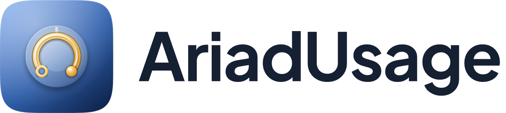

# AriadUsage



AriadUsage tracks the usage, quotas and cost of AI coding assistants on Linux. It is an independent Rust reimplementation of [CodexBar](https://github.com/steipete/CodexBar): the same ideas and behavior, written in a different language, with no runtime dependency on CodexBar. The first release targets [Omarchy](https://omarchy.org), bringing full CodexBar parity to **Claude**, **Codex** and **Antigravity**, with additional providers, desktop environments, macOS and Windows planned for later releases.

## Status

AriadUsage is in development; there is nothing to install yet. The planned install route has two parts:

- the `ariadusage` engine (one binary with a CLI and a background daemon), packaged on the AUR;
- a thin Omarchy bar-widget plugin, `io.github.bavanchun.ariadusage`, listed on the Omarchy plugin marketplace.

## Project documents

- [System architecture](ARCHITECTURE.md): design, roadmap, decision log and open questions
- [Contributor rules](AGENTS.md): agent instructions, security rules, brand assets and command reference
- [IPC v1 protocol](docs/protocol.md): draft wire specification, framing, limits and message definitions
- [Privacy](docs/privacy.md): what AriadUsage reads, writes and sends
- [Porting rules](docs/porting.md): how CodexBar behavior is carried over and deliberate divergences
- [Git workflow](docs/git-workflow.md): branch model, commit conventions and release procedures
- [Brand direction](docs/brand/design-direction.md): design-as-code principles, color tokens and geometry
- [Security reporting](docs/SECURITY.md): vulnerability reporting and disclosure policy

## Development

AriadUsage uses [`just`](https://github.com/casey/just) to run development tasks. Toolchain requirements and runtime versions are pinned in [rust-toolchain.toml](rust-toolchain.toml) and [.node-version](.node-version); task recipes are defined in [justfile](justfile).

### Prerequisites

Running the full local quality gate (`just ci`) requires:

- **Rust**: toolchain pinned in [rust-toolchain.toml](rust-toolchain.toml), with `cargo-nextest` and `cargo-deny`
- **Node.js and pnpm**: runtime pinned in [.node-version](.node-version) and package dependencies in [package.json](package.json)
- **Gitleaks**: for secret scanning across commits
- **Omarchy tree**: accessible through the `OMARCHY_PATH` environment variable for plugin validation and strict `qmllint`

### Commands

To run the full local quality gate:

```bash
just ci
```

To run secret scanning and push the current branch:

```bash
just push
```

For individual checks (formatting, clippy, tests, schemas, brand, plugin validation), see [justfile](justfile) and [AGENTS.md](AGENTS.md).

## Credits

- [CodexBar](https://github.com/steipete/CodexBar) by Peter Steinberger, MIT. AriadUsage ports its behavior, tests and fixtures; see [NOTICE](NOTICE) and [LICENSES/CodexBar-MIT.txt](LICENSES/CodexBar-MIT.txt).
- [lobe-icons](https://github.com/lobehub/lobe-icons) by LobeHub, MIT. Provider logos for Claude, Codex and Antigravity are vendored under `brand/vendor/lobe-icons/`; see [NOTICE](NOTICE) and [LICENSES/lobe-icons-MIT.txt](LICENSES/lobe-icons-MIT.txt). Trademarks belong to their owners.

## License

MIT. See [LICENSE](LICENSE).

